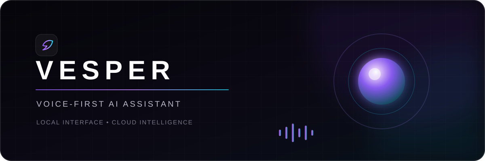
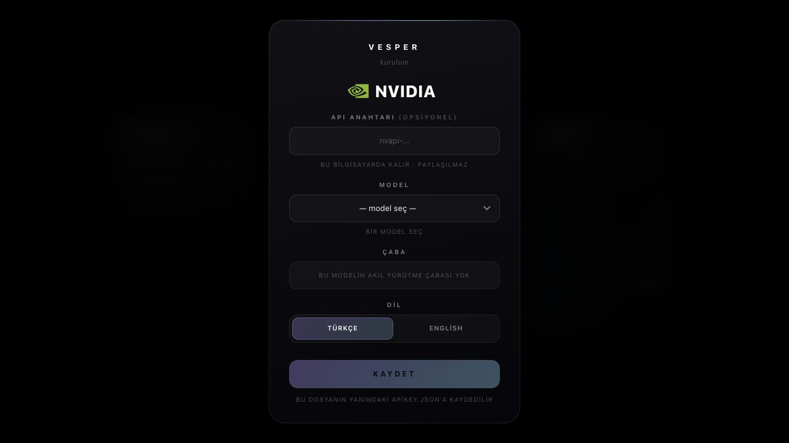

<p align="center">
  
</p>

<p align="center">
  <a href="README_EN.md">English</a> &nbsp;•&nbsp; <strong>Türkçe</strong>
</p>

<p align="center">
  <strong>macOS için odaklı ve ses öncelikli bir yapay zekâ deneyimi.</strong><br>
  Doğal konuş. Yanıtı anlık al. Vesper’dan sesli dinle.
</p>

<p align="center">
  <code>Yerel arayüz</code>&nbsp;&nbsp;
  <code>NVIDIA API</code>&nbsp;&nbsp;
  <code>Türkçe + English</code>&nbsp;&nbsp;
  <code>Opsiyonel çevrimdışı TTS</code>
</p>

---

## Vesper ile tanış

Vesper, tek bir doğal etkileşim etrafında tasarlanmış sinematik bir tarayıcı sesli asistanıdır: **konuş, dinle, devam et**. Arayüzü ve hafif proxy sunucusu Mac’inde yerel olarak çalışır; dil modeli yanıtları NVIDIA API üzerinden anlık olarak aktarılır.

Kurulumda seçilen dil tüm oturum boyunca belirleyicidir. Türkçeyi seçersen Vesper her zaman Türkçe, İngilizceyi seçersen her zaman İngilizce cevap verir; konuşma sırasında başka bir dil kullansan bile seçim değişmez.

<p align="center">
  
</p>

<p align="center"><sub>Gerçek Vesper kurulum ekranı. Harici görsel barındırma veya CDN kullanılmaz.</sub></p>

## Öne çıkanlar

| | Yetenek | Ne sağlar? |
|---|---|---|
| ◉ | Ses öncelikli akış | Konuşma tanıma, anlık yapay zekâ yanıtı ve sesli okuma tek akışta birleşir |
| ◇ | İki sabit dil | Türkçe ve İngilizce; arayüzü, tanımayı, yanıt dilini ve sesi birlikte yönetir |
| ⌁ | Yerel yapılandırma | Tek kalıcı ayar kaynağı `apikey.json` dosyasıdır; eski tarayıcı kayıtları temizlenir |
| ≋ | Yerel nöral sesler | Piper kurulduğunda Türkçede **Fahrettin**, İngilizcede **lessac** kullanılır |
| ⌕ | Canlı web araması | Güncel sorularda Vesper cevaplamadan önce sunucu taraflı arama yapabilir |
| ⏸ | Doğal kesme | Düşünürken, ararken veya konuşurken dokunarak Vesper’ı anında susturabilirsin |
| ⛶ | Tam ekran odak | `F` tuşuyla tam ekrana girip çıkabilirsin |
| ♢ | Temiz seslendirme | Emojiler yazıda görünür; seslendirmeden önce otomatik çıkarılır |

## Nasıl çalışır?

```text
Sesin
  │
  ▼
Tarayıcı konuşma tanıma
  │
  ▼
Yerel Vesper proxy :8777 ─────► NVIDIA API
  │                                 │
  │                                 ▼
  │                            anlık yanıt
  │                                 │
  └─────────────────────────────────┘
                    │
                    ▼
        Piper :8778 veya tarayıcı sesi
                    │
                    ▼
                sesli cevap
```

Yerel proxy, tarayıcının CORS kısıtlamasını çözer; opsiyonel arama ve Piper uçlarını sunar. Dil modelini çevrimdışı hâle getirmez: **yapay zekâ yanıtları için NVIDIA API ve internet bağlantısı gerekir**.

## Hızlı başlangıç

### Gereksinimler

- macOS
- Chrome veya Edge
- Python 3
- Yapay zekâ yanıtları için NVIDIA API anahtarı
- Tarayıcı için mikrofon izni

### 1. İndir

Depoyu ZIP olarak indirip çıkart veya Git ile klonla.

### 2. Başlatıcılara çalışma izni ver

Terminal’de, çıkarttığın `vesper` klasörünün içinde:

```bash
chmod +x openvesper.command closevesper.command
```

### 3. Vesper’ı başlat

`openvesper.command` dosyasına çift tıkla. Yerel sunucu `http://localhost:8777/vesper.html` adresinde başlar ve arayüz varsayılan tarayıcıda açılır.

### 4. Yapılandır

1. NVIDIA API anahtarını (`nvapi-…`) gir.
2. Dahil edilen NVIDIA modellerinden birini seç.
3. Seçilen model destekliyorsa akıl yürütme çabasını belirle.
4. **Türkçe** veya **English** seç.
5. Oluşturulan `apikey.json` dosyasını `vesper.html` ile aynı klasöre kaydet.

> Dolu bir `apikey.json` dosyasını asla commit etme veya paylaşma. Depoda yalnızca boş şablon bulunur.

### 5. Konuş

Vesper başlatmanı istediğinde ekrana bir kez tıkla ve konuş. Duraklatmak, devam etmek veya cevabı kesmek için küreye ya da alt çubuğa dokun. Tam ekran için `F` tuşuna bas.

### Vesper’ı kapat

`closevesper.command` dosyasına çift tıkla.

## Opsiyonel: yerel Piper sesleri

Vesper, Piper olmadan tarayıcı sesine geçerek çalışır. Tasarlanan yerel nöral sesleri kullanmak için Piper’ı bir kez kur:

```bash
/opt/homebrew/bin/python3.12 -m venv all/.piper-venv
all/.piper-venv/bin/pip install piper-tts
```

İlk Piper isteğinde Vesper seçilen ses modelini indirip `all/voices/` altında önbelleğe alır:

- Türkçe: `tr_TR-fahrettin-medium`
- İngilizce: `en_US-lessac-medium`

Model önbelleğe alındıktan sonra ses sentezi yerel çalışır. Ses ortamı ve modeller büyük ve cihaza özel oldukları için depoya eklenmez.

## Yapılandırma

```json
{
  "provider": "",
  "apikey": "",
  "model": "",
  "effort": "",
  "language": ""
}
```

Vesper bu ayarları `localStorage` veya IndexedDB’den geri yüklemez. Boş bir `apikey.json`, her zaman kapatma düğmesi olmayan kurulum ekranını açar.

## Proje yapısı

```text
vesper/
├── vesper.html               # güncel arayüz ve uygulama mantığının tamamı
├── apikey.json               # boş yapılandırma şablonu
├── openvesper.command        # yerel proxy + opsiyonel Piper başlatıcısı
├── closevesper.command       # temiz kapatma
├── README.md                 # dil seçim sayfası
├── README_EN.md              # İngilizce dokümantasyon
├── README_TR.md              # Türkçe dokümantasyon
└── all/
    ├── piper_server.py       # yerel Piper TTS servisi
    ├── tests/                # davranış regresyon testleri
    ├── readme-assets/        # depoya ait görseller
    ├── vesper.py             # önceki terminal sürümü
    └── web/                  # önceki React prototipi
```

## Gizlilik ve ağ sınırları

| Veri veya bileşen | Nereye gider? |
|---|---|
| Arayüz ve proxy | Mac’inde yerel çalışır |
| Yapılandırma | Yerel `apikey.json` dosyasında tutulur |
| Yapay zekâ istemleri ve yanıtları | NVIDIA API’ye gönderilir ve oradan alınır |
| Canlı arama sorguları | Yerel proxy üzerinden DuckDuckGo’ya gönderilir |
| Konuşma tanıma | Seçilen tarayıcı tarafından sağlanır |
| Piper ses sentezi | Kurulum ve ilk model indirmesinden sonra yerel çalışır |

## Tarayıcı desteği

Vesper, Web Speech API kullandığı için **Chrome ve Edge** hedeflenmiştir. Firefox, Opera, Brave ve Vivaldi mevcut konuşma tanıma akışında desteklenmez.

macOS’te ayrıca **Sistem Ayarları → Gizlilik ve Güvenlik → Mikrofon** bölümünden kullandığın tarayıcıya izin ver.

## Testler

Odaklı davranış testlerini çalıştırmak için:

```bash
node --test all/tests/*.test.mjs
```

Testler; emojilerin seslendirilmemesini, tam ekran davranışını, sabit dil yapılandırmasını, boş ayarla açılışı ve GitHub bağlantısının stilini kapsar.

## Sorun giderme

<details>
<summary><strong>.command dosyası açılmıyor</strong></summary>

Hızlı başlangıç bölümündeki `chmod +x` komutunu çalıştır. macOS indirilen dosyayı engellerse bir kez **Control tuşu + tık → Aç** seçeneğini kullan.
</details>

<details>
<summary><strong>Mikrofon başlamıyor</strong></summary>

Chrome veya Edge kullan, site düzeyindeki mikrofon iznini onayla ve macOS mikrofon izinlerinde tarayıcının açık olduğunu doğrula.
</details>

<details>
<summary><strong>Vesper kimlik doğrulama veya model hatası gösteriyor</strong></summary>

Ayarları aç, anahtarın `nvapi-` ile başladığını doğrula ve NVIDIA hesabında etkin olan başka bir model seç.
</details>

<details>
<summary><strong>Fahrettin veya lessac sesi gelmiyor</strong></summary>

Opsiyonel kurulum bölümündeki adımlarla Piper’ı kur. Piper yoksa Vesper bilinçli olarak uygun bir tarayıcı sesine geçer.
</details>

---

<p align="center">
  Odaklı ve eller serbest konuşmalar için geliştirildi.<br>
  <a href="README_EN.md">Switch to the English README →</a>
</p>
